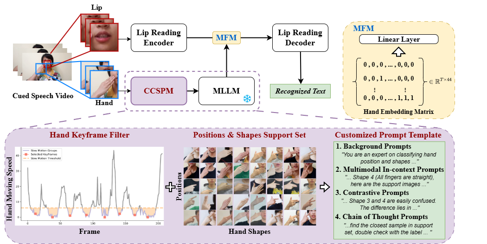
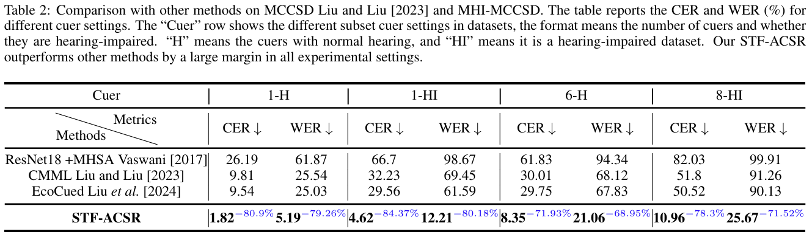

# STF-ACSR: Semi Training-Free Automatic Cued Speech Recognition
 
## Update
`2025-03-12`: We released the code for STF-ACSR, which contains the Chinese Cued Speech Prompt Module and the lip-reading model with Minimalist Fusion Module.
`2025-03-31`: Update the links to the preprint paper and citation BibTeX.

## Introduction
This repository is the new semi-training-free paradigm for ACSR

<div align="center"></div>

From paper: [Lend a Hand: Semi Training-Free Cued Speech Recognition via MLLM-Driven Hand Modeling for Barrier-free Communication](https://arxiv.org/abs/2503.21785)

This framework leverages zero-shot recognition of hand movements through the Chinese CS Prompt Module (CCSPM), which equipped a training-free keyframe 
filtering and customized prompt engineering based on MLLM. It then integrates the recognition results into the lip-reading model using a Minimalist Fusion Module (MFM), effectively achieving superior recognition results.


<div align="center"></div>

This repository contains the implementation of CCSPM and the lip-reading model with MFM.


## Chinese CS Prompt Module (CCSPM)
CCSPM was built based on the openai api. To run the demo, please follow the instructions in the [CCSPM](./CCSPM) folder. Wait for finalization


## Lip-reading Model with MFM
The lip-reading model with MFM was built based on the Auto-AVSR. To run the demo, please follow the instructions in the [LipModel_MFM](./LipModel_MFM) folder. Wait for finalization

## Citation

If you find this repository helpful, please consider citing our work:

```bibtex
@misc{huang2025lendhandsemitrainingfree,
      title={Lend a Hand: Semi Training-Free Cued Speech Recognition via MLLM-Driven Hand Modeling for Barrier-free Communication}, 
      author={Guanjie Huang and Danny Hin Kwok Tsang and Li Liu},
      year={2025},
      eprint={2503.21785},
      archivePrefix={arXiv},
      primaryClass={eess.AS},
      url={https://arxiv.org/abs/2503.21785}, 
}
```


## Acknowledgement

Thanks [Auto-AVSR](https://github.com/mpc001/Visual_Speech_Recognition_for_Multiple_Languages) as the backbone of the lip-reading model.


## Contact

Contributions are welcome; feel free to create a PR or email me:

```
ghuang565@connect.hkust-gz.edu.cn
```
