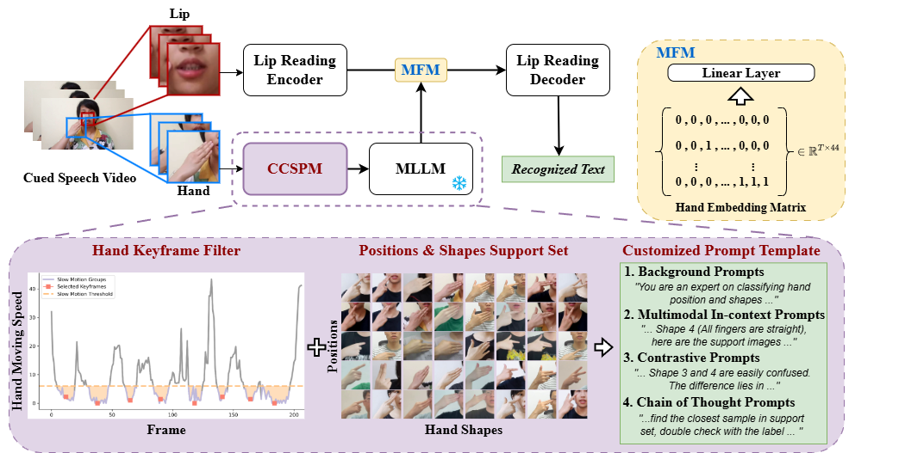
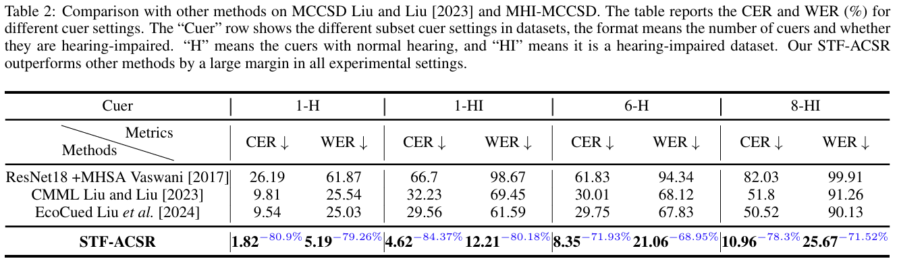

# STF-ACSR

## Updates

- **2026-08-18:** Reorganized the release for reproducible CSPM/MFM training
  and evaluation, with portable configuration, regression tests, CI and a
  real-checkpoint smoke test.
- **2025-03-31:** Added the preprint link and citation BibTeX.
- **2025-03-12:** Released the initial STF-ACSR implementation.

Official implementation of [**Lend a Hand: Semi Training-Free Cued Speech
Recognition via MLLM-Driven Hand Modeling for Barrier-Free
Communication**](https://arxiv.org/abs/2503.21785).

STF-ACSR combines two components:

- **Cued Speech Prompt Module (CSPM):** training-free hand-keyframe selection
  and MLLM-based hand-position/hand-shape classification.
- **Minimalist Fusion Module (MFM):** a learned linear projection that adds
  phoneme-level hand prompts to the lip-reading encoder features before joint
  CTC/attention decoding.

<div align="center"></div>

## What is trained?

CSPM itself does not require task-specific training. The lip-reading encoder,
MFM projection and joint CTC/attention decoder are trained together. The
repository expects pre-segmented lip ROI videos, hand ROI videos and per-frame
hand-center coordinates; dataset preparation is intentionally kept separate
from model training.

## Repository layout

```text
CSPM/                    Keyframe filtering, support set and OpenAI inference
LipModel_MFM/            Lip-reading model, MFM, training and evaluation
tests/                   Dependency-light regression and request-contract tests
doc/                     Paper figures
```

The bundled `LipModel_MFM/fairseq` and `LipModel_MFM/espnet` directories are
the research dependencies used by the released model.

## Installation

The reference server environment uses Python 3.8, PyTorch 2.0.1, torchvision
0.15.2, PyTorch Lightning 1.5.10 and Hydra 1.3.2. Install the matching PyTorch
build for your CUDA version first, then install the remaining dependencies:

```bash
python -m pip install -r requirements.txt
python -m pip install -r requirements-dev.txt
```

Checkpoints and datasets are not committed to Git. Keep them outside the
repository and pass their paths through configuration overrides.

## 1. Run CSPM

Set the API key in the environment; never put it in source files:

```bash
export OPENAI_API_KEY="your-key"
python -m CSPM.CustomizedPromptTemplate \
  --video CSPM/HS-0001.mp4 \
  --positions CSPM/HS-0001.npy \
  --support-set CSPM/support_set \
  --output outputs/cspm/HS-0001.json
```

On PowerShell, use `$env:OPENAI_API_KEY="your-key"`. The default model is
`gpt-4o`; override it with `--model` or `OPENAI_MODEL`. The implementation
uses high-detail base64 image inputs and Pydantic structured outputs. A request
is not sent until the CLI or `generate_recognition_single` is called.

The output contains the selected original-video frame indices and one
`hand_position` (0-4) plus one `hand_shape` (0-7) per keyframe.

## 2. Prepare MFM labels

Each CSV row consumed by `AVDataset_CCS` has six comma-separated fields:

```text
dataset_name,lip_video,input_frames,phoneme_ids,hand_json,hand_positions_npy
```

`hand_json` may use the released `hand_shape` field or the legacy
`hand_gesture` alias. Relative hand paths are resolved under `root_dir`.
New CSPM output follows the paper's grouping threshold `theta=2`; the loader
also detects the strictly-consecutive grouping used by previously released JSON
files so existing checkpoints and labels remain reproducible.

Example Hydra dataset overrides:

```bash
data.dataset.root_dir=/data/CCS \
data.dataset.label_dir=CCS_lip/labels \
data.dataset.train_file=train_labels_hand.csv \
data.dataset.val_file=val_labels_hand.csv \
data.dataset.test_file=test_labels_hand.csv
```

## 3. Train the lip model and MFM

```bash
cd LipModel_MFM
python train_CCS_hand.py \
  data.dataset.root_dir=/data/CCS \
  pretrained_model_path=/checkpoints/visual_frontend.pth \
  exp_dir=outputs exp_name=stf_acsr gpu=0
```

The training entry point no longer selects a hard-coded GPU. The learnable MFM
weight is initialized to `0.1`, matching the released implementation.

## 4. Evaluate a checkpoint

```bash
cd LipModel_MFM
python evaluate_CCS_hand.py \
  data.dataset.root_dir=/data/CCS \
  exp_dir=/checkpoints exp_name=stf_acsr \
  ckpt_path=best.ckpt gpu=0 limit_test_batches=1
```

Set `limit_test_batches=null` for the full test split. Evaluation reports CER,
WER and token-level edit distance and can optionally save decoded phoneme
sequences with `output_results=true output_path=outputs/predictions.txt`.

## Validation

Run the lightweight checks from the repository root:

```bash
python -m unittest discover -v
python -m compileall -q CSPM LipModel_MFM tests
```

The test suite covers the paper's keyframe grouping rule, hand-prompt matrix
construction, legacy JSON compatibility, OpenAI request schema and checkpoint
normalization. A real checkpoint smoke test additionally requires the model
environment and dataset described above.

## Results

<div align="center"></div>

See the paper for the full experimental protocol and results across Chinese and
British Cued Speech datasets.

## Citation

```bibtex
@inproceedings{huang2026lend,
  title     = {Lend a Hand: Semi Training-Free Cued Speech Recognition via
               MLLM-Driven Hand Modeling for Barrier-Free Communication},
  author    = {Huang, Guanjie and Tsang, Danny H. K. and Zhang, Xiao-Ping and Liu, Li},
  booktitle = {IEEE International Conference on Acoustics, Speech and Signal Processing},
  year      = {2026}
}
```

## Acknowledgement

The lip-reading backbone is based on
[Auto-AVSR](https://github.com/mpc001/Visual_Speech_Recognition_for_Multiple_Languages).

## Contact

- Homepage: [Guanjie Huang](https://dennishgj.github.io/)
- Email: `ghuang565@connect.hkust-gz.edu.cn`
